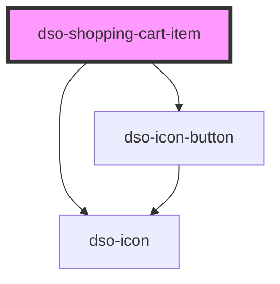

# `<dso-shopping-cart-item>`

 
<!-- Auto Generated Below -->

## Properties

| Property  | Attribute | Description                                                            | Type                         | Default     |
| --------- | --------- | ---------------------------------------------------------------------- | ---------------------------- | ----------- |
| `info`    | `info`    | An optional line of information shown below the name.                  | `string \| undefined`        | `undefined` |
| `label`   | `label`   | The name of the item. In the `form` variant this is used as the title. | `string \| undefined`        | `undefined` |
| `variant` | `variant` | The variant of the Shopping Cart Item.                                 | `"form" \| "main" \| "side"` | `"side"`    |
| `warning` | `warning` | When set a warning icon is rendered before the name.                   | `boolean`                    | `false`     |

## Events

| Event       | Description                                                          | Type                                       |
| ----------- | -------------------------------------------------------------------- | ------------------------------------------ |
| `dsoClose`  | Emitted when the user clicks the close button in the `form` variant. | `CustomEvent<ShoppingCartItemCloseEvent>`  |
| `dsoDelete` | Emitted when the user clicks the delete (trash) action.              | `CustomEvent<ShoppingCartItemDeleteEvent>` |
| `dsoEdit`   | Emitted when the user clicks the edit (pencil) action.               | `CustomEvent<ShoppingCartItemEditEvent>`   |

## Slots

| Slot | Description                                                                                                                 |
| ---- | --------------------------------------------------------------------------------------------------------------------------- |
|      | In the `form` variant it holds the form content. In the `side` and `main` variants it can hold nested Shopping Cart Item's. |

## Dependencies

### Depends on

- [dso-icon](../../icon)
- [dso-icon-button](../../icon-button)

### Graph

----------------------------------------------

*Built with [StencilJS](https://stenciljs.com/)*
