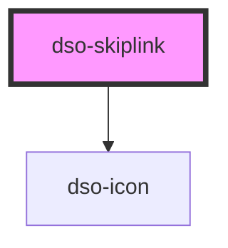

# dso-skiplink

<!-- Auto Generated Below -->

## Properties

| Property             | Attribute | Description                               | Type                  | Default     |
| -------------------- | --------- | ----------------------------------------- | --------------------- | ----------- |
| `label` _(required)_ | `label`   | link text                                 | `string`              | `undefined` |
| `to` _(required)_    | `to`      | The location to which the skiplink links. | `string \| undefined` | `undefined` |

## Dependencies

### Depends on

- [dso-icon](../icon)

### Graph

----------------------------------------------

*Built with [StencilJS](https://stenciljs.com/)*
