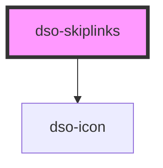

# dso-skiplinks

<!-- Auto Generated Below -->

## Properties

| Property          | Attribute | Description                              | Type                  | Default     |
| ----------------- | --------- | ---------------------------------------- | --------------------- | ----------- |
| `label`           | `label`   | link text                                | `string \| undefined` | `undefined` |
| `to` _(required)_ | `to`      | The URL to which the Card heading links. | `string \| undefined` | `undefined` |

## Dependencies

### Depends on

- [dso-icon](../icon)

### Graph

----------------------------------------------

*Built with [StencilJS](https://stenciljs.com/)*
