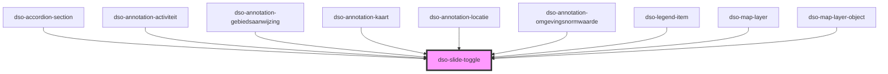

# `<dso-slide-toggle>`

<!-- Auto Generated Below -->

## Properties

| Property          | Attribute          | Description                                                                                                                   | Type                  | Default     |
| ----------------- | ------------------ | ----------------------------------------------------------------------------------------------------------------------------- | --------------------- | ----------- |
| `accessibleLabel` | `accessible-label` | When provided the `<button>` will be labelled with `aria-label`. For a visible label provide a `` inside the component. | `string \| undefined` | `undefined` |
| `checked`         | `checked`          | Set to true if Slide Toggle is checked.                                                                                       | `boolean`             | `false`     |
| `disabled`        | `disabled`         | Disables the Slide Toggle, preventing it from checking/unchecking and therefor not emitting any events.                       | `boolean`             | `false`     |
| `identifier`      | `identifier`       | Provide an `id` for the `<button>`. Useful for placing your to place your own `<label for="id">`.                             | `string`              | `v4()`      |
| `labelledbyId`    | `labelledby-id`    | Provide the `id` of the element that labels this element. this property sets the `aria-labelledby` on the switch button.      | `string \| undefined` | `undefined` |

## Events

| Event             | Description                                            | Type                                  |
| ----------------- | ------------------------------------------------------ | ------------------------------------- |
| `dsoActiveChange` | Emitted when user checks or unchecks the Slide Toggle. | `CustomEvent<SlideToggleActiveEvent>` |

## Dependencies

### Used by

 - [dso-accordion-section](../accordion/components)
 - [dso-annotation-activiteit](../annotation/annotation-activiteit)
 - [dso-annotation-gebiedsaanwijzing](../annotation/annotation-gebiedsaanwijzing)
 - [dso-annotation-kaart](../annotation/annotation-kaart)
 - [dso-annotation-locatie](../annotation/annotation-locatie)
 - [dso-annotation-omgevingsnormwaarde](../annotation/annotation-omgevingsnormwaarde)
 - [dso-legend-item](../legend-item)
 - [dso-map-layer](../map-layer)
 - [dso-map-layer-object](../map-layer/components)

### Graph

----------------------------------------------

*Built with [StencilJS](https://stenciljs.com/)*
