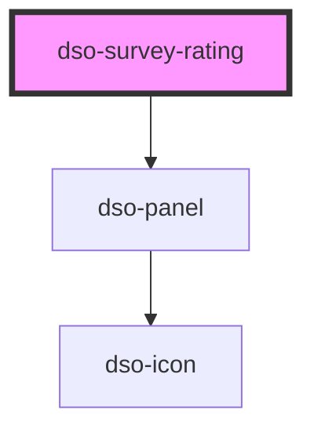

# `<dso-survey-rating>`

<!-- Auto Generated dso-toolkit -->

## Types

### SurveyRatingCloseEvent

```typescript
export interface SurveyRatingCloseEvent {
  originalEvent: Event;
}
```

<!-- src/components/survey-rating/survey-rating.interfaces.ts::SurveyRatingCloseEvent -->

### SurveyRatingSubmitEvent

```typescript
export interface SurveyRatingSubmitEvent {
  /** The selected rating. One-based. */
  rating: number | undefined;
  scale: SurveyRatingScale;
  originalEvent?: Event;
}
```

<!-- src/components/survey-rating/survey-rating.interfaces.ts::SurveyRatingSubmitEvent -->

<!-- Auto Generated Below -->

## Events

| Event       | Description                                             | Type                                   |
| ----------- | ------------------------------------------------------- | -------------------------------------- |
| `dsoClose`  | Emitted when the user wants to close the Survey Rating. | `CustomEvent<SurveyRatingCloseEvent>`  |
| `dsoSubmit` | Emitted when the user submits the Survey Rating.        | `CustomEvent<SurveyRatingSubmitEvent>` |

## Dependencies

### Depends on

- [dso-panel](../panel)

### Graph



---

_Built with [StencilJS](https://stenciljs.com/)_
