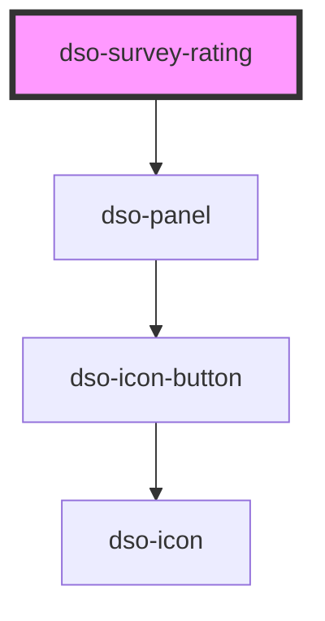

# `<dso-survey-rating>`

<!-- Auto Generated Below -->

## Events

| Event       | Description                                              | Type                                   |
| ----------- | -------------------------------------------------------- | -------------------------------------- |
| `dsoClose`  | Emitted when the user wants to close the  Survey Rating. | `CustomEvent<SurveyRatingCloseEvent>`  |
| `dsoSubmit` | Emitted when the user submits the Survey Rating.         | `CustomEvent<SurveyRatingSubmitEvent>` |

## Dependencies

### Depends on

- [dso-panel](../panel)

### Graph

----------------------------------------------

*Built with [StencilJS](https://stenciljs.com/)*
