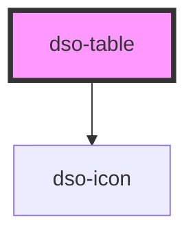

# dso-table

<!-- Auto Generated Below -->

## Properties

| Property       | Attribute       | Description                                                      | Type      | Default |
| -------------- | --------------- | ---------------------------------------------------------------- | --------- | ------- |
| `isResponsive` | `is-responsive` | Indicates whether the table is currently horizontally scrollable | `boolean` | `false` |
| `modal`        | `modal`         | Allows the table to opened in a modal.                           | `boolean` | `false` |
| `responsive`   | `responsive`    | Allows the table to be scrolled horizontally if it does not fit. | `boolean` | `false` |

## Dependencies

### Depends on

- [dso-icon](../icon)

### Graph

----------------------------------------------

*Built with [StencilJS](https://stenciljs.com/)*
