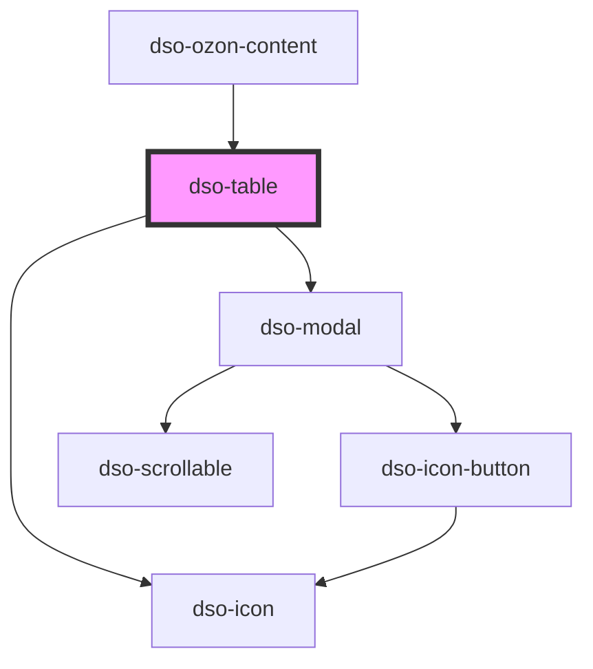

# `<dso-table>`

<!-- Auto Generated Below -->

## Properties

| Property  | Attribute  | Description                                 | Type      | Default |
| --------- | ---------- | ------------------------------------------- | --------- | ------- |
| `noModal` | `no-modal` | Prevents the table being opened in a modal. | `boolean` | `false` |

## Dependencies

### Used by

 - [dso-ozon-content](../ozon-content)

### Depends on

- [dso-modal](../modal)
- [dso-icon](../icon)

### Graph

----------------------------------------------

*Built with [StencilJS](https://stenciljs.com/)*
