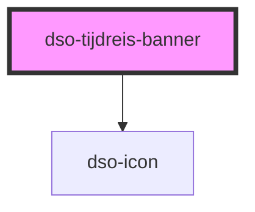

# `<dso-tijdreis-banner>`

<!-- Auto Generated Below -->

## Slots

| Slot       | Description                                         |
| ---------- | --------------------------------------------------- |
|            | A slot to place the primary banner text or message. |
| `"button"` | A slot to place an action button in.                |

## Dependencies

### Depends on

- [dso-icon](../icon)

### Graph

----------------------------------------------

*Built with [StencilJS](https://stenciljs.com/)*
