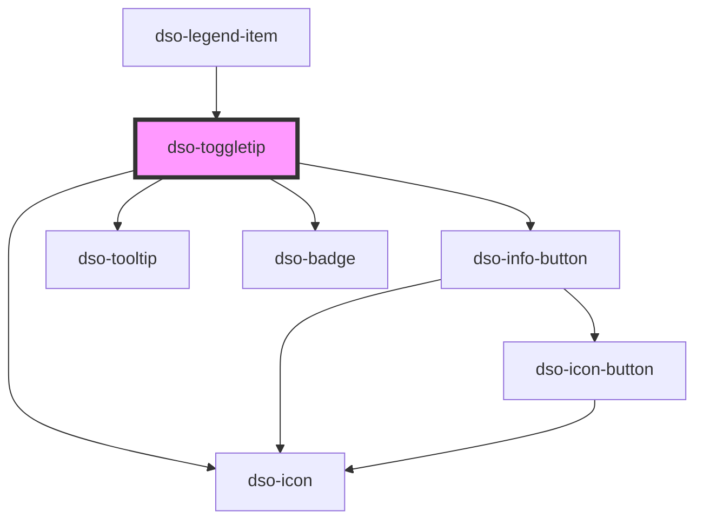

# `<dso-toggletip>`

<!-- Auto Generated Below -->

## Properties

| Property      | Attribute      | Description                                              | Type                                                                                                                                                                 | Default         |
| ------------- | -------------- | -------------------------------------------------------- | -------------------------------------------------------------------------------------------------------------------------------------------------------------------- | --------------- |
| `badgeStatus` | `badge-status` | The type of badge when `mode`=`badge`                    | `"attention" \| "error" \| "info" \| "outline" \| "primary" \| "success" \| "warning" \| undefined`                                                                  | `undefined`     |
| `icon`        | `icon`         | The icon when `mode`=`icon`                              | `string \| undefined`                                                                                                                                                | `undefined`     |
| `iconActive`  | `icon-active`  | The icon when `mode`=`icon` and the Toggletip is visible | `string \| undefined`                                                                                                                                                | `undefined`     |
| `label`       | `label`        | Toggletip label.                                         | `string`                                                                                                                                                             | `"Toelichting"` |
| `mode`        | `mode`         | The type of Toggletip.                                   | `"badge" \| "icon" \| "secondary" \| "toggle"`                                                                                                                       | `"toggle"`      |
| `position`    | `position`     | Toggletip position.                                      | `"bottom" \| "bottom-end" \| "bottom-start" \| "left" \| "left-end" \| "left-start" \| "right" \| "right-end" \| "right-start" \| "top" \| "top-end" \| "top-start"` | `"right"`       |
| `small`       | `small`        | Set to true for small Toggletip.                         | `boolean \| undefined`                                                                                                                                               | `undefined`     |
| `strategy`    | `strategy`     | Positioning strategy                                     | `"absolute" \| "fixed"`                                                                                                                                              | `"absolute"`    |

## Dependencies

### Used by

 - [dso-legend-item](../legend-item)

### Depends on

- [dso-info-button](../info-button)
- [dso-badge](../badge)
- [dso-icon](../icon)

### Graph

----------------------------------------------

*Built with [StencilJS](https://stenciljs.com/)*
