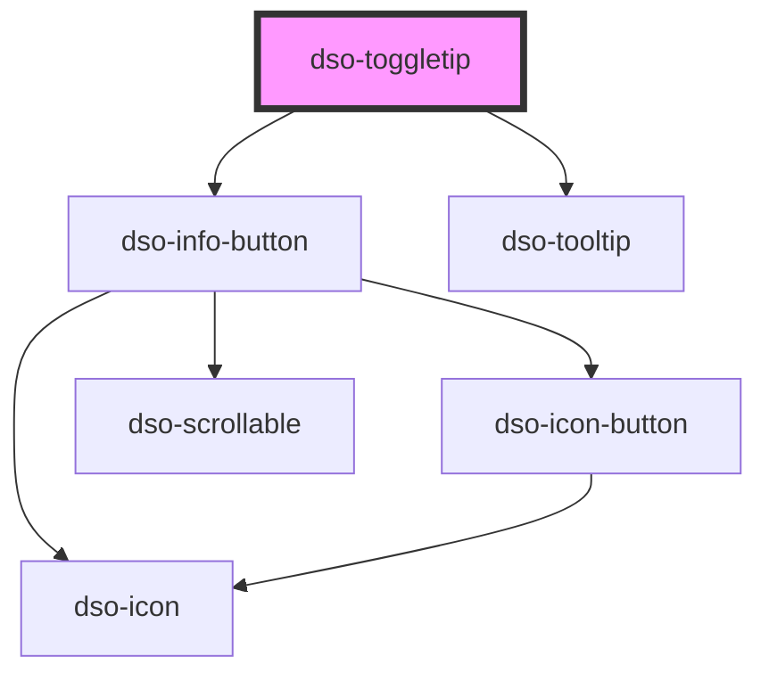

# `<dso-toggletip>`

<!-- Auto Generated Below -->

## Properties

| Property    | Attribute   | Description                          | Type                                                                                                                                                                                                         | Default         |
| ----------- | ----------- | ------------------------------------ | ------------------------------------------------------------------------------------------------------------------------------------------------------------------------------------------------------------ | --------------- |
| `label`     | `label`     | Toggletip label.                     | `string`                                                                                                                                                                                                     | `"Toelichting"` |
| `position`  | `position`  | Toggletip position.                  | `"auto" \| "auto-end" \| "auto-start" \| "bottom" \| "bottom-end" \| "bottom-start" \| "left" \| "left-end" \| "left-start" \| "right" \| "right-end" \| "right-start" \| "top" \| "top-end" \| "top-start"` | `"right"`       |
| `secondary` | `secondary` | Set to true for secondary Toggletip. | `boolean \| undefined`                                                                                                                                                                                       | `undefined`     |
| `small`     | `small`     | Set to true for small Toggletip.     | `boolean \| undefined`                                                                                                                                                                                       | `undefined`     |

## Dependencies

### Depends on

- [dso-info-button](../info-button)
- [dso-tooltip](../tooltip)

### Graph

----------------------------------------------

*Built with [StencilJS](https://stenciljs.com/)*
