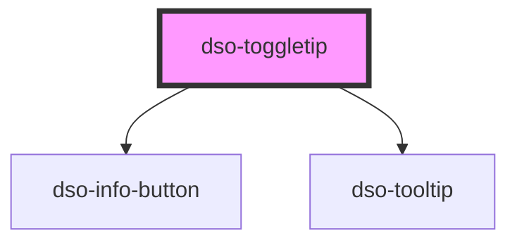

# `<dso-toggletip>`

<!-- Auto Generated Below -->

## Properties

| Property   | Attribute  | Description | Type                                     | Default         |
| ---------- | ---------- | ----------- | ---------------------------------------- | --------------- |
| `label`    | `label`    |             | `string`                                 | `"Toelichting"` |
| `position` | `position` |             | `"bottom" \| "left" \| "right" \| "top"` | `"right"`       |

## Dependencies

### Depends on

- [dso-info-button](../info-button)
- [dso-tooltip](../tooltip)

### Graph

----------------------------------------------

*Built with [StencilJS](https://stenciljs.com/)*
