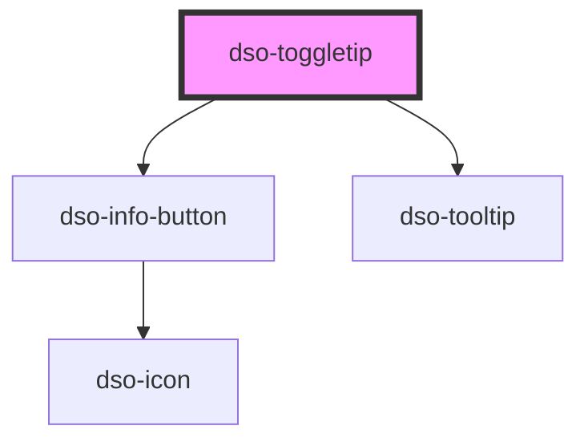

# `<dso-toggletip>`

<!-- Auto Generated Below -->

## Properties

| Property    | Attribute   | Description | Type                                     | Default         |
| ----------- | ----------- | ----------- | ---------------------------------------- | --------------- |
| `label`     | `label`     |             | `string`                                 | `"Toelichting"` |
| `position`  | `position`  |             | `"bottom" \| "left" \| "right" \| "top"` | `"right"`       |
| `secondary` | `secondary` |             | `boolean \| undefined`                   | `undefined`     |
| `small`     | `small`     |             | `boolean \| undefined`                   | `undefined`     |

## Dependencies

### Depends on

- [dso-info-button](../info-button)
- [dso-tooltip](../tooltip)

### Graph

----------------------------------------------

*Built with [StencilJS](https://stenciljs.com/)*
