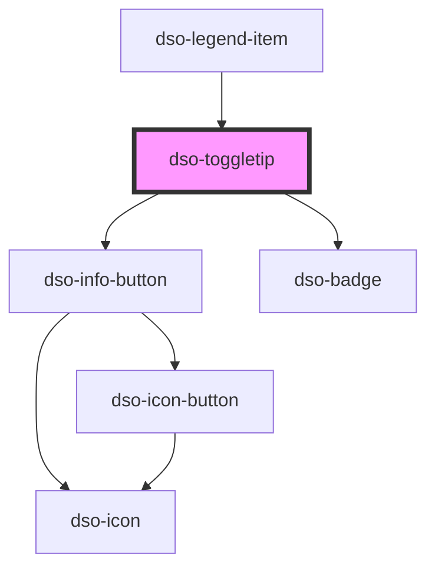

# `<dso-toggletip>`

<!-- Auto Generated Below -->

## Properties

| Property    | Attribute   | Description                                                      | Type                                                                                                | Default              |
| ----------- | ----------- | ---------------------------------------------------------------- | --------------------------------------------------------------------------------------------------- | -------------------- |
| `label`     | `label`     | The label of the Toggletip which is shown on hover in a tooltip. | `string`                                                                                            | `"Toon toelichting"` |
| `message`   | `message`   | The label of the Badge when the variant is "badge".              | `string \| undefined`                                                                               | `undefined`          |
| `placement` | `placement` | The placement of the Tooltip when the Toggletip is active.       | `"bottom" \| "left" \| "right" \| "top"`                                                            | `"right"`            |
| `status`    | `status`    | The status of the Badge when variant is "badge".                 | `"attention" \| "error" \| "info" \| "outline" \| "primary" \| "success" \| "warning" \| undefined` | `undefined`          |
| `variant`   | `variant`   | The variant of the Toggletip: "information" or "badge".          | `"badge" \| "information"`                                                                          | `"information"`      |

## Dependencies

### Used by

 - [dso-legend-item](../legend-item)

### Depends on

- [dso-info-button](../info-button)
- [dso-badge](../badge)

### Graph

----------------------------------------------

*Built with [StencilJS](https://stenciljs.com/)*
