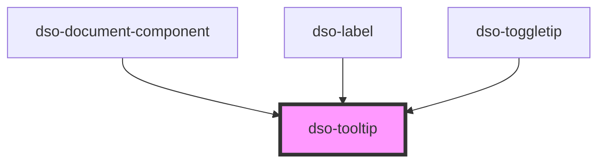

# `<dso-tooltip>`

Een tooltip hoort bij een `target` element. Dit kan aangegeven worden met het attribuut `id`. Het target element hoort een `aria-describedby` attribuut te hebben met dezelfde waarde.

Scriptend de tooltip tonen/verbergen kan met de instance methods `activate()` en `deactivate()` of met het het attribuut `active`.

Het positioneren van de tooltip wordt met [Popper](https://popper.js.org/) gedaan.

<!-- Auto Generated Below -->

## Properties

| Property      | Attribute     | Description                                                                                                                                                                      | Type                                     | Default     |
| ------------- | ------------- | -------------------------------------------------------------------------------------------------------------------------------------------------------------------------------- | ---------------------------------------- | ----------- |
| `active`      | `active`      | Whether or not to show the tooltip. To control the tooltip add the `active` attribute or use the `activate()` and `deactivate()` instance methods.                               | `boolean`                                | `false`     |
| `descriptive` | `descriptive` | Defines if the tooltip is descriptive. A descriptive tooltip contains a meaningful message. Tooltips that are not descriptive are hidden from screenreaders using `aria-hidden`. | `boolean`                                | `false`     |
| `noArrow`     | `no-arrow`    | Set attribute `no-arrow` to hide the arrow                                                                                                                                       | `boolean`                                | `false`     |
| `position`    | `position`    | Set position of tooltip relative to target                                                                                                                                       | `"bottom" \| "left" \| "right" \| "top"` | `"top"`     |
| `small`       | `small`       | Defines if the tooltip has a smaller max-width                                                                                                                                   | `boolean \| undefined`                   | `undefined` |
| `stateless`   | `stateless`   | Deactivates mouseover behaviour                                                                                                                                                  | `boolean \| undefined`                   | `undefined` |
| `strategy`    | `strategy`    | Set position strategy of tooltip                                                                                                                                                 | `"absolute" \| "auto" \| "fixed"`        | `"auto"`    |

## Methods

### `activate() => Promise<void>`

Activate the tooltip (Sets the `active` attribute)

#### Returns

Type: `Promise<void>`

### `deactivate() => Promise<void>`

Deactivate the tooltip (Removes the `active` attribute)

#### Returns

Type: `Promise<void>`

## Dependencies

### Used by

 - [dso-document-component](../document-component)
 - [dso-label](../label)
 - [dso-toggletip](../toggletip)

### Graph

----------------------------------------------

*Built with [StencilJS](https://stenciljs.com/)*
