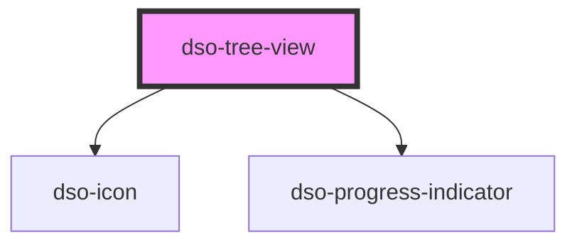

# dso-map-controls

<!-- Auto Generated Below -->

## Properties

| Property                  | Attribute | Description | Type                     | Default     |
| ------------------------- | --------- | ----------- | ------------------------ | ----------- |
| `collection` _(required)_ | --        |             | `TreeViewItem<string>[]` | `undefined` |

## Events

| Event       | Description | Type                                  |
| ----------- | ----------- | ------------------------------------- |
| `clickItem` |             | `CustomEvent<TreeViewItem<string>[]>` |
| `closeItem` |             | `CustomEvent<TreeViewItem<string>[]>` |
| `openItem`  |             | `CustomEvent<TreeViewItem<string>[]>` |

## Dependencies

### Depends on

- [dso-icon](../icon)
- [dso-progress-indicator](../progress-indicator)

### Graph

----------------------------------------------

*Built with [StencilJS](https://stenciljs.com/)*
