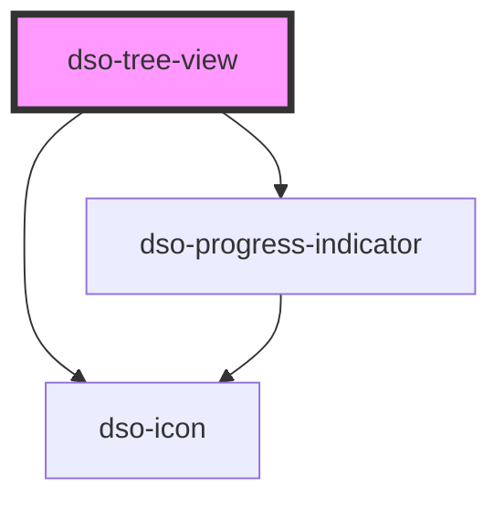

# `<dso-tree-view>`

The collection property of the Tree View is an array of `TreeViewItem`. The collection is an immutable array containing the state of the Tree View that should be managed _outside_ of Tree View.

### State management

When the user interacts with the Tree View, events are emitted when a node is opened, closed or clicked. The Tree View events will provide the complete path of TreeViewItems from the root to the item that is emitting the event. The consumer of the Tree View should update the TreeView's collection on the open and close events with the new state.

<!-- Auto Generated dso-toolkit -->

## Types

### TreeViewItem

```typescript
export interface TreeViewItem {
  /** The id of the item */
  id: string;
  /** The label of the item */
  label: string;
  /** The optional href of the item (creates a link) */
  href?: string;
  /** Indicates whether the item has children */
  hasItems: boolean;
  /** The array of child items */
  items?: TreeViewItem[];
  /** Indicates whether the node is open and child items are shown */
  open?: boolean;
  /** Indicates the node is loading child items */
  loading?: boolean;
  /** Indicates the node is active, only one item should be active */
  active?: boolean;
  /** Indicates the node is selected, multiple items can be selected */
  selected?: boolean;
  /** An optional array of icons */
  icons?: TreeViewItemIcon[];
}
```

<!-- src/components/tree-view/tree-view.interfaces.ts::TreeViewItem -->

### TreeViewPointerEvent

```typescript
export interface TreeViewPointerEvent {
  /** The path to the clicked item */
  path: TreeViewItem[];
  /** The original pointer event */
  originalEvent: MouseEvent;
}
```

<!-- src/components/tree-view/tree-view.interfaces.ts::TreeViewPointerEvent -->

<!-- Auto Generated Below -->

## Properties

| Property                  | Attribute    | Description                     | Type             | Default     |
| ------------------------- | ------------ | ------------------------------- | ---------------- | ----------- |
| `collection` _(required)_ | `collection` | The collection of TreeViewItems | `TreeViewItem[]` | `undefined` |

## Events

| Event          | Description                                                                                                                                                                                                                                                                                                                                                                                                                                                     | Type                                |
| -------------- | --------------------------------------------------------------------------------------------------------------------------------------------------------------------------------------------------------------------------------------------------------------------------------------------------------------------------------------------------------------------------------------------------------------------------------------------------------------- | ----------------------------------- |
| `dsoClickItem` | Emitted when a tree view item is clicked. The `detail` property of the `CustomEvent` will contain an object with: `path` = the complete path of TreeViewItems from the root to the item that is emitting the clicked event. `originalEvent` = the original click event. The consumer of the event is responsible for updating the TreeView's collection (usually set the active state on the last TreeViewItem in path and clear all other active item states). | `CustomEvent<TreeViewPointerEvent>` |
| `dsoCloseItem` | Emitted when a tree view item is closed. The `detail` property of the `CustomEvent` will contain the complete path of TreeViewItems from the root to the item that is emitting the close event. The consumer of the event is responsible for updating the TreeView's collection (usually set the closed state on the last TreeViewItem in path).                                                                                                                | `CustomEvent<TreeViewItem[]>`       |
| `dsoOpenItem`  | Emitted when a tree view item is opened. The `detail` property of the `CustomEvent` will contain the complete path of TreeViewItems from the root to the item that is emitting the open event. The consumer of the event is responsible for updating the TreeView's collection (usually set the open state on the last TreeViewItem in path).                                                                                                                   | `CustomEvent<TreeViewItem[]>`       |

## Methods

### `focusItem(path: TreeViewItem[]) => Promise<boolean>`

Set focus on the last item in the specified path.
The consumer is responsible for providing a TreeView collection where the last item is visible.

#### Parameters

| Name   | Type             | Description |
| ------ | ---------------- | ----------- |
| `path` | `TreeViewItem[]` |             |

#### Returns

Type: `Promise<boolean>`

Whether the item was found.

## Dependencies

### Depends on

- [dso-icon](../icon)
- [dso-progress-indicator](../progress-indicator)

### Graph



---

_Built with [StencilJS](https://stenciljs.com/)_
