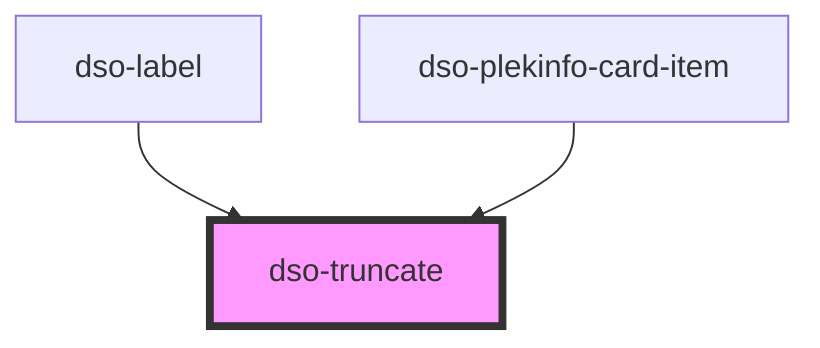

# `<dso-truncate>`

Toont zijn inhoud op één regel. Past de inhoud niet, dan eindigt de tekst op een ellipsis en wordt het element
focusbaar. Bij hover of focus verschijnt een tooltip met de volledige inhoud (inclusief opmaak zoals `dso-renvooi`),
en Escape sluit die tooltip weer.

<!-- Auto Generated Below -->

## Slots

| Slot | Description          |
| ---- | -------------------- |
|      | Content to truncate. |

## Dependencies

### Used by

 - [dso-label](../label)
 - [dso-plekinfo-card-item](../plekinfo-card/plekinfo-card-item)

### Graph

----------------------------------------------

*Built with [StencilJS](https://stenciljs.com/)*
