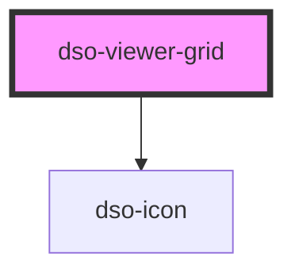

# `<dso-viewer-grid>`

<!-- Auto Generated Below -->

## Properties

| Property      | Attribute      | Description | Type      | Default |
| ------------- | -------------- | ----------- | --------- | ------- |
| `overlayOpen` | `overlay-open` |             | `boolean` | `false` |

## Events

| Event          | Description | Type                                       |
| -------------- | ----------- | ------------------------------------------ |
| `closeOverlay` |             | `CustomEvent<KeyboardEvent \| MouseEvent>` |

## Dependencies

### Depends on

- [dso-icon](../icon)

### Graph

----------------------------------------------

*Built with [StencilJS](https://stenciljs.com/)*
