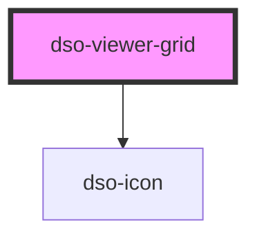

# `<dso-viewer-grid>`

<!-- Auto Generated Below -->

## Properties

| Property          | Attribute           | Description | Type                                          | Default     |
| ----------------- | ------------------- | ----------- | --------------------------------------------- | ----------- |
| `filterpanelOpen` | `filterpanel-open`  |             | `boolean`                                     | `false`     |
| `initialMainSize` | `initial-main-size` |             | `"large" \| "medium" \| "small" \| undefined` | `undefined` |
| `overlayOpen`     | `overlay-open`      |             | `boolean`                                     | `false`     |

## Events

| Event               | Description | Type                                       |
| ------------------- | ----------- | ------------------------------------------ |
| `closeOverlay`      |             | `CustomEvent<KeyboardEvent \| MouseEvent>` |
| `filterpanelApply`  |             | `CustomEvent<FilterpanelEvent>`            |
| `filterpanelCancel` |             | `CustomEvent<FilterpanelEvent>`            |
| `mainSizeChange`    |             | `CustomEvent<ViewerGridChangeSizeEvent>`   |

## Dependencies

### Depends on

- [dso-icon](../icon)

### Graph

----------------------------------------------

*Built with [StencilJS](https://stenciljs.com/)*
