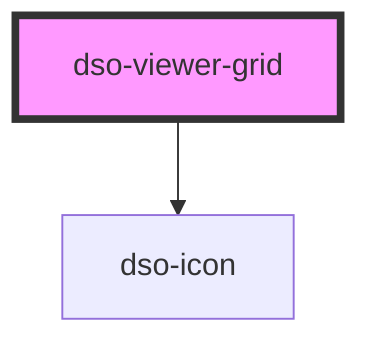

# `<dso-viewer-grid>`

<!-- Auto Generated Below -->

## Properties

| Property          | Attribute           | Description                                                                                                                      | Type                                          | Default     |
| ----------------- | ------------------- | -------------------------------------------------------------------------------------------------------------------------------- | --------------------------------------------- | ----------- |
| `filterpanelOpen` | `filterpanel-open`  | Set to true when filterpanel should show.                                                                                        | `boolean`                                     | `false`     |
| `initialMainSize` | `initial-main-size` | Size of the main content panel when component loads. Changing this attribute afterwards has no effect.  Default size is `large`. | `"large" \| "medium" \| "small" \| undefined` | `undefined` |
| `overlayOpen`     | `overlay-open`      | Set to true when overlay should show.                                                                                            | `boolean`                                     | `false`     |

## Events

| Event                  | Description                                                                                   | Type                                     |
| ---------------------- | --------------------------------------------------------------------------------------------- | ---------------------------------------- |
| `dsoCloseOverlay`      | Emitted when user wants to close the overlay.                                                 | `CustomEvent<OverlayEvent>`              |
| `dsoFilterpanelApply`  | Emitted when user applies filterpanel options.                                                | `CustomEvent<FilterpanelEvent>`          |
| `dsoFilterpanelCancel` | Emitted when user cancels filterpanel.                                                        | `CustomEvent<FilterpanelEvent>`          |
| `dsoMainSizeChange`    | Emitted before and after main size animation. Inspect `detail` property for more information. | `CustomEvent<ViewerGridChangeSizeEvent>` |

## Dependencies

### Depends on

- [dso-icon](../icon)

### Graph

----------------------------------------------

*Built with [StencilJS](https://stenciljs.com/)*
